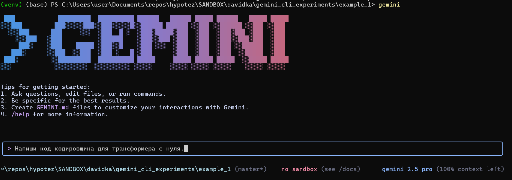
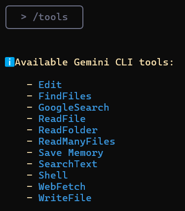
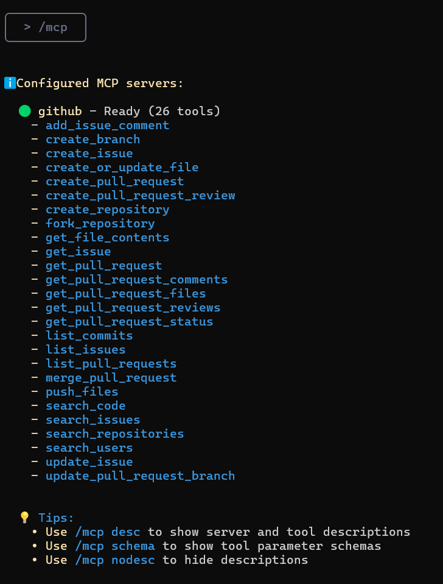

## Gemini CLI: Introduction and First Steps.

**Gemini CLI** is a tool that works directly in your terminal, understands your codebase, and helps you fix errors with natural language queries. This is Google's answer to Anthropic's Claude Code.
You can use Gemini 1.5 Pro (when you hit the limit, the tool will switch to Gemini 1.5 Flash) and its 1 million token context window to make up to 60 requests per minute and 1000 requests per day, all for free.

### Contents
*   Understanding and navigating large codebases
*   Detecting and fixing errors
*   Writing and testing code
*   Gemini CLI tools
*   Integrating Google CLI with MCP

### Key features of Gemini CLI:
*   **Editing and refactoring:** Automatically improves and simplifies your code under AI guidance.
*   **Error detection and correction:** Finds bugs and suggests fixes.
*   **Code understanding:** Gemini CLI can summarize architecture, explain module roles, or build execution flow maps.
*   **Test generation:** Automatically creates test cases for `pytest`
*   **Documentation support:** You can create structured markdown documents, changelogs, and responses to GitHub issues directly in the terminal.
*   **Command execution:** Gemini CLI can execute shell commands such as `git`, `npm`, `pip`, and others, allowing you to manage projects without leaving the CLI.

---

### Step 1: Prerequisites

To get started, install Node.js (version 18 or higher). You can download the installer of your choice or run the following bash commands in your terminal:

```bash
# Download and install nvm (Node Version Manager):
curl -o- https://raw.githubusercontent.com/nvm-sh/nvm/v0.40.3/install.sh | bash

# Initialize nvm in the current terminal session
. "$HOME/.nvm/nvm.sh"

# Download and install Node.js (e.g., version 22):
nvm install 22

# Check the Node.js version:
node -v # Should output "v22.17.0" or similar

# Check the npm version:
npm -v # Should output "10.9.2" or similar
```

> ⚠️ **Important for Windows users:**
> The `nvm` command above is for **Linux/macOS** and **will not work in PowerShell or cmd.exe**.
> For Windows, use [nvm-windows](https://github.com/coreybutler/nvm-windows) by downloading `nvm-setup.exe` from the [Releases](https://github.com/coreybutler/nvm-windows/releases) section.
> Alternatively, you can install WSL (Windows Subsystem for Linux) and run the commands in Ubuntu or another Linux distribution.

---
### Step 2: Setting up Gemini CLI

#### Step 2.1: Installing Gemini CLI
Once Node.js and npm are installed and verified, install Gemini CLI by running the following command in your terminal:
```bash
npx https://github.com/google-gemini/gemini-cli
```
Or use `npm` to install it globally:
```bash
npm install -g @google/gemini-cli
gemini
```
After installation, type `gemini` in the terminal to access the tool.

#### Step 2.2: Authentication
You can use your personal Google account to authenticate. This will give you up to 60 requests per minute and 1000 requests per day when using Gemini.


In this guide, I used **Sign in with Google**, but you can also use an **API key** (set as an environment variable or in a `.env` file) or authenticate via **Vertex AI**.

To generate a new API key, sign in to **AI Studio** with your Google account and click "Create API key".
```bash
# Set the key as an environment variable
export GEMINI_API_KEY="Your_API_Key"

# Or create a .env file
GEMINI_API_KEY="Your_API_Key"
```
You can use the `/auth` command in the text box to switch authentication methods as needed.

---

### Step 3: Setting up a project in Gemini CLI

Once the CLI is running, we can start interacting with Gemini from the terminal. There are two ways to work with a project.

#### 1. Start a new project
To start a project from scratch, run the following commands:
```bash
cd new-project/
gemini
```
Inside the CLI, use a prompt to solve the problem you are interested in, for example:
> Write the encoder code for a transformer from scratch.

Give permission to write files:


#### 2. Work with an existing project
If you already have a codebase, you can work with it by running the following commands:
```bash
git clone https://github.com/AashiDutt/Google-Agent-Development-Kit-Demo
cd Google-Agent-Development-Kit-Demo
gemini
```
Inside the CLI, use a prompt, for example:
> Provide me with a summary of all changes made to the codebase in the last month.

---

### Step 4: Experimenting with Gemini CLI
As an example, I will use the **[ADK-based 🌍🛫 travel planner](https://github.com/AashiDutt/Google-Agent-Development-Kit-Demo)** project.
With Gemini CLI, I will show you how to:
1.  explore the codebase
2.  detect a bug or issue on GitHub or in a file
3.  refactor the code and generate unit tests
4.  create a markdown report of the changes made
5.  visualize the codebase by generating a flowchart

#### Exploring and understanding the codebase
Let's start by asking Gemini to explore and explain the codebase.

**Prompt:** `Explore the current directory and describe the project architecture.`

Gemini CLI will return a structured summary explaining the architecture:
*   **User interface:** A Streamlit application (`travel_ui.py`) provides an interface for interaction.
*   **Orchestration:** `host_agent` acts as a central coordinator.
*   **Specialized agents:** `flight_agent`, `stay_agent`, `activities_agent` for searching for flights, hotels, and entertainment.
*   **Communication:** Agents communicate with each other via a RESTful API on FastAPI.
*   **Shared components:** `shared/schemas.py` defines common data structures.

This will help you get your bearings without reading every file manually.

#### Analyzing and fixing a GitHub issue
Let's explore some open issues from the GitHub repository.

**Prompt:** `Here is a GitHub issue: [@search https://github.com/AashiDutt/Google-Agent-Development-Kit-Demo/issues/1]. Analyze the codebase and propose a 3-step fix plan. Which files/functions should be changed?`

Gemini CLI investigated the issue:
*   Using the `@search` function, it retrieved data from GitHub.
*   Identified the root cause as a JSON serialization error (in this case, the asynchronous function `create_session()` was not called with `await`).
*   Suggested changes and response handling in several files.

Next, the CLI waits for user input to evaluate the changes. If the user agrees, it will apply the suggested changes.

#### Implementing and testing the fix
Now let's implement and test the fixes suggested by Gemini.

**Prompt:** `Write a unit test for this change in pytest in the test_shared.py file.`

Gemini CLI:
*   Inserted `json.dumps()` before sending the task payload.
*   Created `test_agents.py` to add unit tests.
*   Added a new test case to check the schema and the transfer of nested agent messages.

#### Generating documentation
Now that the fixes have been made, let's summarize the changes and write them down in Markdown in a `.txt` file.

**Prompt:** `Write a markdown summary of the bug, fix, and test coverage. Format this as a changelog entry under version "v0.2.0".`

Then, to save the summary to a document, I used the following prompt:

**Prompt:** `Save this summary to a .txt file and name it summary.txt`

Gemini CLI uses the `WriteFile` tool to save the `summary.txt` file to the project directory.

#### Generating a flowchart using MCP
This section expands on previous experiments where I explore how Gemini CLI uses the **Model Context Protocol (MCP)** to maintain file-level summaries and task history between prompts. This gives Gemini a "working memory" within a session.

**Prompt:** `Generate a flowchart that shows how agents communicate via A2A (agent-to-agent) and how main.py manages the system. Highlight where the problem occurred and how it was fixed.`

This visualization was made possible by Gemini's persistent memory, which retained the full context of our previous bug fix and agent structure without having to reload the files.

### Available Gemini CLI tools
Calling the `/tools` command in Gemini CLI will show a list of available tools that can be used to perform various tasks, such as editing code, generating tests, creating documentation, and much more.


**ReadFolder (ls)**
Lists files and folders in a directory - analogous to the `ls` command on the command line.

**ReadFile (read-file)**
Reads the full content of a single file, which is useful for creating summaries or analysis.

**ReadManyFiles (read-many-files)**
Reads multiple files at once, usually by a pattern (e.g., all `.js` files).

**FindFiles (glob)**
Searches for files by a pattern (e.g., find all `config.json` files in your project).

**SearchText (grep)**
Searches for text within files, for example, to find all `TODO` comments.

**Edit (edit)**
Applies code changes using a `diff`. Gemini shows a preview of the edits and asks for confirmation before applying them.

**WriteFile (write-file)**
Creates new files (e.g., `README.md`) with user-provided content.

**Shell (shell)**
Executes commands directly in the terminal if you prefix them with `!` (e.g., `!npm test`).

**WebFetch (web-fetch)**
Downloads content from the web (HTML or JSON), allowing Gemini to analyze external data.

**GoogleSearch (web-search)**
Performs a Google search to base answers on real information (e.g., to find an explanation for an error).

**Save Memory (memoryTool)**
Saves facts or preferences during a session (e.g., "I prefer async/await") to improve the consistency and coherence of responses.

### Advanced features

You can add special instructions for the AI for a specific project by
creating a `GEMINI.md` file in the root directory of your project.
Inside this file, you can define project rules,
code styles, and tools that the agent should use. This ensures that the generated code meets your project's standards.

[Example of a system instruction](https://github.com/hypo69/hypotez/blob/master/src/endpoints/hypo69/code_assistant/instructions/CODE_RULES.EN.MD)

### Integrating Google CLI with MCP

For most everyday tasks, the built-in tools will be sufficient. But what if you want Gemini CLI to do something highly specialized, such as interacting with specific APIs or using a specialized model (say, an image generator or a security analysis tool)? This is where MCP (Model Context Protocol) comes in.

In essence, MCP is an open standard that allows developers to add new tools and capabilities to the AI by running a server that the CLI can interact with. In Gemini CLI, you can configure "MCP servers" in a JSON settings file, and the CLI will treat them as additional tools it can use.

#### How to set up an MCP server in Google CLI

As an example, I will show you how to set up an MCP server for GitHub in Gemini CLI.

Inside your project folder, create a folder using the command:

```bash
mkdir -p .gemini && touch .gemini/settings.json
```
Fill the file with this code:
```json
{
  "mcpServers": {
    "github": {
      "command": "npx",
      "args": ["-y", "@modelcontextprotocol/server-github"],
      "env": { "GITHUB_PERSONAL_ACCESS_TOKEN": "[YOUR-TOKEN]" }
    }
  }
}
```
[instructions on how to get a token](https://docs.github.com/en/authentication/keeping-your-account-and-data-secure/managing-your-personal-access-tokens#creating-a-personal-access-token-classic)
After that, type `/quit` in Gemini CLI to exit, and then open it again.
You will see that the GitHub MCP server is running and ready to use.

Enter the `/mcp` command, and you will see a list of GitHub tools.
