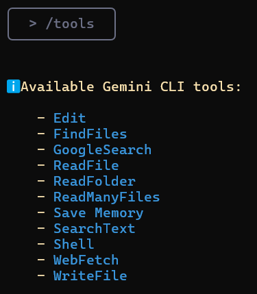

## Gemini CLI: Introducción y primeros pasos.

**Gemini CLI** es una herramienta que funciona directamente en tu terminal, comprende tu base de código y te ayuda a corregir errores con consultas en lenguaje natural. Es la respuesta de Google a Claude Code de Anthropic.
Puedes usar Gemini 1.5 Pro (cuando alcances el límite, la herramienta cambiará a Gemini 1.5 Flash) y su ventana de contexto de 1 millón de tokens para realizar hasta 60 solicitudes por minuto y 1000 solicitudes por día, todo de forma gratuita.

### Contenido
*   Comprender y navegar por grandes bases de código
*   Detectar y corregir errores
*   Escribir y probar código
*   Herramientas de Gemini CLI
*   Integración de Google CLI con MCP

### Características clave de Gemini CLI:
*   **Edición y refactorización:** Mejora y simplifica automáticamente tu código bajo la guía de la IA.
*   **Detección y corrección de errores:** Encuentra errores y sugiere soluciones.
*   **Comprensión del código:** Gemini CLI puede resumir la arquitectura, explicar los roles de los módulos o construir mapas de flujo de ejecución.
*   **Generación de pruebas:** Crea automáticamente casos de prueba para `pytest`
*   **Soporte de documentación:** Puedes crear documentos markdown estructurados, registros de cambios y respuestas a problemas de GitHub directamente en la terminal.
*   **Ejecución de comandos:** Gemini CLI puede ejecutar comandos de shell como `git`, `npm`, `pip` y otros, lo que te permite administrar proyectos sin salir de la CLI.

---

### Paso 1: Requisitos previos

Para empezar, instala Node.js (versión 18 o superior). Puedes descargar el instalador de tu elección o ejecutar los siguientes comandos bash en tu terminal:

```bash
# Descargar e instalar nvm (Node Version Manager):
curl -o- https://raw.githubusercontent.com/nvm-sh/nvm/v0.40.3/install.sh | bash

# Inicializar nvm en la sesión de terminal actual
. "$HOME/.nvm/nvm.sh"

# Descargar e instalar Node.js (por ejemplo, la versión 22):
nvm install 22

# Comprobar la versión de Node.js:
node -v # Debería mostrar "v22.17.0" o similar

# Comprobar la versión de npm:
npm -v # Debería mostrar "10.9.2" o similar
```

> ⚠️ **Importante para usuarios de Windows:**
> El comando `nvm` anterior es para **Linux/macOS** y **no funcionará en PowerShell o cmd.exe**.
> Para Windows, usa [nvm-windows](https://github.com/coreybutler/nvm-windows) descargando `nvm-setup.exe` de la sección [Releases](https://github.com/coreybutler/nvm-windows/releases).
> Alternativamente, puedes instalar WSL (Subsistema de Windows para Linux) y ejecutar los comandos en Ubuntu u otra distribución de Linux.

---
### Paso 2: Configuración de Gemini CLI

#### Paso 2.1: Instalación de Gemini CLI
Una vez que Node.js y npm estén instalados y verificados, instala Gemini CLI ejecutando el siguiente comando en tu terminal:
```bash
npx https://github.com/google-gemini/gemini-cli
```
O usa `npm` para instalarlo globalmente:
```bash
npm install -g @google/gemini-cli
gemini
```
Después de la instalación, escribe `gemini` en la terminal para acceder a la herramienta.

#### Paso 2.2: Autenticación
Puedes usar tu cuenta personal de Google para autenticarte. Esto te dará hasta 60 solicitudes por minuto y 1000 solicitudes por día al usar Gemini.


En esta guía, usé **Iniciar sesión con Google**, pero también puedes usar una **clave API** (establecida como variable de entorno o en un archivo `.env`) o autenticarte a través de **Vertex AI**.

Para generar una nueva clave API, inicia sesión en **AI Studio** con tu cuenta de Google y haz clic en "Crear clave API".
```bash
# Establecer la clave como variable de entorno
export GEMINI_API_KEY="Your_API_Key"

# O crear un archivo .env
GEMINI_API_KEY="Your_API_Key"
```
Puedes usar el comando `/auth` en el cuadro de texto para cambiar los métodos de autenticación según sea necesario.

---

### Paso 3: Configuración de un proyecto en Gemini CLI

Una vez que la CLI esté en funcionamiento, podemos comenzar a interactuar con Gemini desde la terminal. Hay dos formas de trabajar con un proyecto.

#### 1. Iniciar un nuevo proyecto
Para iniciar un proyecto desde cero, ejecuta los siguientes comandos:
```bash
cd new-project/
gemini
```
Dentro de la CLI, usa un prompt para resolver el problema que te interese, por ejemplo:
> Escribe el código del codificador para un transformador desde cero.

Da permiso para escribir archivos:


#### 2. Trabajar con un proyecto existente
Si ya tienes una base de código, puedes trabajar con ella ejecutando los siguientes comandos:
```bash
git clone https://github.com/AashiDutt/Google-Agent-Development-Kit-Demo
cd Google-Agent-Development-Kit-Demo
gemini
```
Dentro de la CLI, usa un prompt, por ejemplo:
> Proporcióname un resumen de todos los cambios realizados en la base de código en el último mes.

---

### Paso 4: Experimentando con Gemini CLI
Como ejemplo, usaré el proyecto **[Planificador de viajes 🌍🛫 basado en ADK](https://github.com/AashiDutt/Google-Agent-Development-Kit-Demo)**.
Con Gemini CLI, te mostraré cómo:
1.  explorar la base de código
2.  detectar un error o problema en GitHub o en un archivo
3.  refactorizar el código y generar pruebas unitarias
4.  crear un informe markdown de los cambios realizados
5.  visualizar la base de código generando un diagrama de flujo

#### Explorando y comprendiendo la base de código
Comencemos pidiéndole a Gemini que explore y explique la base de código.

**Prompt:** `Explora el directorio actual y describe la arquitectura del proyecto.`

Gemini CLI devolverá un resumen estructurado explicando la arquitectura:
*   **Interfaz de usuario:** Una aplicación Streamlit (`travel_ui.py`) proporciona una interfaz para la interacción.
*   **Orquestación:** `host_agent` actúa como un coordinador central.
*   **Agentes especializados:** `flight_agent`, `stay_agent`, `activities_agent` para buscar vuelos, hoteles y entretenimiento.
*   **Comunicación:** Los agentes se comunican entre sí a través de una API RESTful en FastAPI.
*   **Componentes compartidos:** `shared/schemas.py` define estructuras de datos comunes.

Esto te ayudará a orientarte sin leer cada archivo manualmente.

#### Analizando y corrigiendo un problema de GitHub
Exploremos algunos problemas abiertos del repositorio de GitHub.

**Prompt:** `Aquí hay un problema de GitHub: [@search https://github.com/AashiDutt/Google-Agent-Development-Kit-Demo/issues/1]. Analiza la base de código y propón un plan de corrección de 3 pasos. ¿Qué archivos/funciones deben cambiarse?`

Gemini CLI investigó el problema:
*   Usando la función `@search`, recuperó datos de GitHub.
*   Identificó la causa raíz como un error de serialización JSON (en este caso, la función asíncrona `create_session()` no se llamó con `await`).
*   Sugirió cambios y manejo de respuestas en varios archivos.

A continuación, la CLI espera la entrada del usuario para evaluar los cambios. Si el usuario está de acuerdo, aplicará los cambios sugeridos.

#### Implementando y probando la corrección
Ahora implementemos y probemos las correcciones sugeridas por Gemini.

**Prompt:** `Escribe una prueba unitaria para este cambio en pytest en el archivo test_shared.py.`

Gemini CLI:
*   Insertó `json.dumps()` antes de enviar la carga útil de la tarea.
*   Creó `test_agents.py` para agregar pruebas unitarias.
*   Agregó un nuevo caso de prueba para verificar el esquema y la transferencia de mensajes de agente anidados.

#### Generando documentación
Ahora que se han realizado las correcciones, resumamos los cambios y escribámoslos en Markdown en un archivo `.txt`.

**Prompt:** `Escribe un resumen markdown del error, la corrección y la cobertura de las pruebas. Formatea esto como una entrada de registro de cambios bajo la versión "v0.2.0".`

Luego, para guardar el resumen en un documento, usé el siguiente prompt:

**Prompt:** `Guarda este resumen en un archivo .txt y nómbralo summary.txt`

Gemini CLI usa la herramienta `WriteFile` para guardar el archivo `summary.txt` en el directorio del proyecto.

#### Generando un diagrama de flujo usando MCP
Esta sección amplía los experimentos anteriores donde exploro cómo Gemini CLI usa el **Protocolo de contexto del modelo (MCP)** para mantener resúmenes a nivel de archivo e historial de tareas entre prompts. Esto le da a Gemini una "memoria de trabajo" dentro de una sesión.

**Prompt:** `Genera un diagrama de flujo que muestre cómo los agentes se comunican a través de A2A (agente a agente) y cómo main.py gestiona el sistema. Resalta dónde ocurrió el problema y cómo se solucionó.`

Esta visualización fue posible gracias a la memoria persistente de Gemini, que retuvo el contexto completo de nuestra corrección de errores anterior y la estructura del agente sin tener que recargar los archivos.

### Herramientas de Gemini CLI disponibles
Al llamar al comando `/tools` en Gemini CLI, se mostrará una lista de herramientas disponibles que se pueden usar para realizar varias tareas, como editar código, generar pruebas, crear documentación y mucho más.


**ReadFolder (ls)**
Lista archivos y carpetas en un directorio, análogo al comando `ls` en la línea de comandos.

**ReadFile (read-file)**
Lee el contenido completo de un solo archivo, lo cual es útil para crear resúmenes o análisis.

**ReadManyFiles (read-many-files)**
Lee varios archivos a la vez, generalmente por un patrón (por ejemplo, todos los archivos `.js`).

**FindFiles (glob)**
Busca archivos por un patrón (por ejemplo, encontrar todos los archivos `config.json` en tu proyecto).

**SearchText (grep)**
Busca texto dentro de los archivos, por ejemplo, para encontrar todos los comentarios `TODO`.

**Edit (edit)**
Aplica cambios de código usando un `diff`. Gemini muestra una vista previa de las ediciones y solicita confirmación antes de aplicarlas.

**WriteFile (write-file)**
Crea nuevos archivos (por ejemplo, `README.md`) con el contenido proporcionado por el usuario.

**Shell (shell)**
Ejecuta comandos directamente en la terminal si los prefijas con `!` (por ejemplo, `!npm test`).

**WebFetch (web-fetch)**
Descarga contenido de la web (HTML o JSON), lo que permite a Gemini analizar datos externos.

**GoogleSearch (web-search)**
Realiza una búsqueda en Google para basar las respuestas en información real (por ejemplo, para encontrar una explicación para un error).

**Save Memory (memoryTool)**
Guarda hechos o preferencias durante una sesión (por ejemplo, "prefiero async/await") para mejorar la coherencia y coherencia de las respuestas.

### Funciones avanzadas

Puedes añadir instrucciones especiales para la IA para un proyecto específico
creando un archivo `GEMINI.md` en el directorio raíz de tu proyecto.
Dentro de este archivo, puedes definir las reglas del proyecto,
los estilos de código y las herramientas que el agente debe usar. Esto asegura que el código generado cumpla con los estándares de tu proyecto.

[Ejemplo de una instrucción del sistema](https://github.com/hypo69/hypotez/blob/master/src/endpoints/hypo69/code_assistant/instructions/CODE_RULES.EN.MD)

### Integración de Google CLI con MCP

Para la mayoría de las tareas diarias, las herramientas integradas serán suficientes. Pero, ¿qué pasa si quieres que Gemini CLI haga algo muy especializado, como interactuar con API específicas o usar un modelo especializado (por ejemplo, un generador de imágenes o una herramienta de análisis de seguridad)? Aquí es donde entra en juego el MCP (Protocolo de contexto del modelo).

En esencia, MCP es un estándar abierto que permite a los desarrolladores añadir nuevas herramientas y capacidades a la IA ejecutando un servidor con el que la CLI puede interactuar. En Gemini CLI, puedes configurar "servidores MCP" en un archivo de configuración JSON, y la CLI los tratará como herramientas adicionales que puede usar.

#### Cómo configurar un servidor MCP en Google CLI

Como ejemplo, te mostraré cómo configurar un servidor MCP para GitHub en Gemini CLI.

Dentro de la carpeta de tu proyecto, crea una carpeta con el comando:

```bash
mkdir -p .gemini && touch .gemini/settings.json
```
Rellena el archivo con este código:
```json
{
  "mcpServers": {
    "github": {
      "command": "npx",
      "args": ["-y", "@modelcontextprotocol/server-github"],
      "env": { "GITHUB_PERSONAL_ACCESS_TOKEN": "[YOUR-TOKEN]" }
    }
  }
}
```
[instrucciones sobre cómo obtener un token](https://docs.github.com/en/authentication/keeping-your-account-and-data-secure/managing-your-personal-access-tokens#creating-a-personal-access-token-classic)
Después de eso, escribe `/quit` en Gemini CLI para salir, y luego ábrelo de nuevo.
Verás que el servidor MCP de GitHub está en funcionamiento y listo para usar.

Introduce el comando `/mcp`, y verás una lista de herramientas de GitHub.
