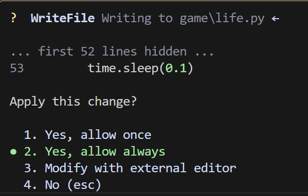
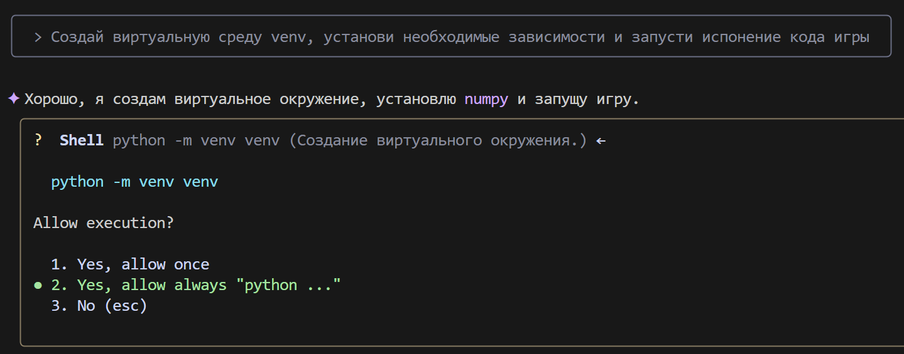
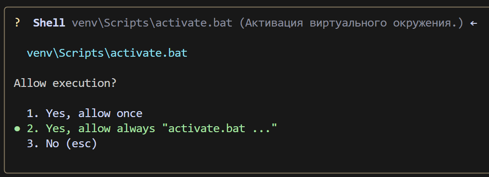
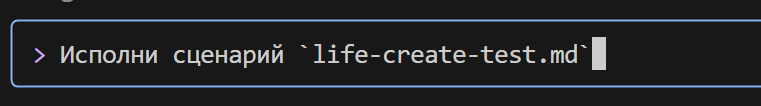
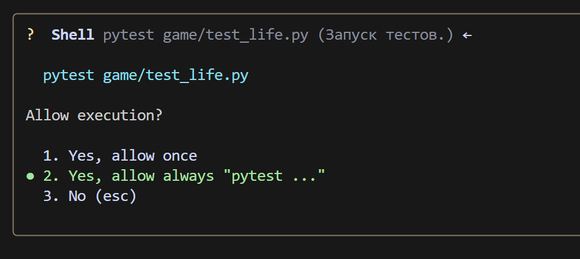
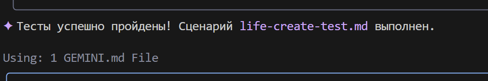
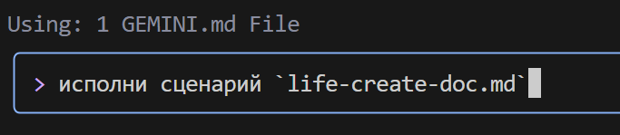

### **Escenario para Gemini CLI: Juego de la Vida**

#### **Paso 1: Creación de una instrucción del sistema `GEMINI.MD`**
En el directorio de trabajo, crea un archivo `GEMINI.md` e inserta la instrucción del sistema en él. Ejemplo de instrucción:
```markdown
## 📘 Instrucción para la generación de código Python

### 1. Reglas generales

* Usa **Python 3.10+**.
* Adhiérete a un **estilo de codificación claro, legible y sin ambigüedades**.
* **Cada función, método y clase** debe tener:

  * Anotaciones de tipo (`type hints`)
  * Documentación completa y correcta en formato `docstring` (ver sección 3)
  * Comentarios internos (`#`), donde sea necesario

---

### 2. Comentarios

* Los comentarios deben ser **precisos** y describir **lo que hace el código**, no "lo que hacemos".
* **Prohibido** usar pronombres: `hacemos`, `devolvemos`, `enviamos`, `vamos`, etc.
* **Permitido** solo los términos: `extracción`, `ejecución`, `llamada`, `reemplazo`, `verificación`, `envío`, `La función realiza`, `La función cambia el valor`, etc.

#### ❌ Ejemplo de comentario incorrecto:

```python
# Obtener valor del parámetro
```

#### ✅ Ejemplo de comentario correcto:

```python
# La función extrae el valor del parámetro
```

---

### 3. Docstring (formato de documentación)

Cada función/método/clase debe contener un `docstring` en el siguiente formato:

```python
def function(param: str, param1: Optional[str | dict | str] = None) -> dict | None:
    """
    Args:
        param (str): Descripción del parámetro `param`.
        param1 (Optional[str | dict | str], optional): Descripción del parámetro `param1`. Por defecto `None`.

    Returns:
        dict | None: Descripción del valor de retorno. Devuelve un diccionario o `None`.

    Raises:
        SomeError: Descripción de la situación en la que se produce la excepción `SomeError`.

    Example:
        >>> function('param', 'param1')
        {'param': 'param1'}
    """
```

* **Todos los parámetros y valores de retorno deben ser descritos.**
* Las formulaciones deben ser **concisas, precisas y sin ambigüedades**.
* No se permite omitir la descripción de parámetros/valores de retorno/excepciones.

---

### 4. Anotación de tipo

* **Todas las variables, parámetros y valores de retorno** deben ser anotados.
* Usa la sintaxis de Python 3.10+: `list[int]`, `dict[str, Any]`, `str | None`, etc.
* Ejemplos de anotaciones correctas:

#### ✅ Tipos simples:

```python
name: str = "John"
count: int = 42
flag: bool = True
```

#### ✅ Colecciones y tipos complejos:

```python
from typing import Any, Optional, Callable, TypeAlias

coordinates: tuple[float, float] = (55.75, 37.61)
metadata: dict[str, Any] = {"debug": True}
UserId: TypeAlias = int
```

#### ✅ Funciones y métodos:

```python
def get_user_name(user_id: int) -> str:
    """Devuelve el nombre del usuario por su identificador."""
    ...
```

#### ✅ Funciones asíncronas:

```python
async def fetch_users() -> AsyncIterator[dict[str, int | str]]:
    ...
```

#### ✅ Tipos genéricos:

```python
from typing import TypeVar, Generic

T = TypeVar("T")

class Container(Generic[T]):
    def __init__(self, value: T) -> None:
        self.value = value

    def get(self) -> T:
        return self.value
```

---

### 5. Otros

* Usa `default_factory` en `dataclass` para valores mutables (`list`, `dict`).
* Para valores `Optional`, especifica `T | None` (Python 3.10+) o `Optional[T]`.
* Para estructuras complejas, usa `TypeAlias`.

---

📌 **Sugerencia**: Al generar código, incluye siempre anotaciones de tipo, `docstring`, y evita el lenguaje subjetivo en los comentarios. El objetivo es la estructura de código más precisa, reproducible y formalizada posible.


Este archivo se utilizará para configurar Gemini CLI.

Para mayor comodidad, creemos un directorio `game`, que almacenará los archivos del proyecto, y un directorio `scenarios`, que almacenará los escenarios para Gemini CLI.

El archivo `scenarios/life-create-code.md` contendrá las instrucciones para crear el código del "Juego de la Vida",
el archivo `scenarios/life-create-test.md` contendrá las instrucciones para crear pruebas,
y el archivo `scenarios/life-create-doc.md` contendrá las instrucciones para crear documentación.

life-create-code.md:
```markdown
Dentro del directorio `game`, crea un archivo `life.py`.
Dentro, escribe la implementación del "Juego de la Vida" de Conway en Python, usando un enfoque orientado a objetos.
Usa las bibliotecas: `numpy`, `pygame` (para gráficos).


Requisitos:
1.  Crea una clase `Game`.
2.  En `__init__`, la clase debe aceptar las dimensiones de la cuadrícula (ancho, alto) y crear un campo inicial aleatorio.
3.  Crea un método `step()` que actualice el estado del juego un paso de acuerdo con las reglas:
    - Una célula viva con < 2 vecinos vivos muere (soledad).
    - Una célula viva con 2 o 3 vecinos vivos sobrevive.
    - Una célula viva con > 3 vecinos vivos muere (superpoblación).
    - Una célula muerta con exactamente 3 vecinos vivos se vuelve viva (nacimiento).
4.  Crea un método `display()` o anula `__str__` para imprimir el campo en la consola. Usa caracteres, por ejemplo '■' para una célula viva y ' ' para una muerta.
5.  Usa la biblioteca `numpy` para operaciones eficientes con la cuadrícula.
6.  En el bloque `if __name__ == '__main__':` añade un ejemplo que cree un juego y ejecute la simulación en un bucle con un pequeño retraso entre pasos.
7. Para la visualización del juego, usa pygame o una biblioteca de gráficos, si es posible.
```

---

life-create-test.md:
```markdown
Dentro del directorio `game`, usando el contexto del archivo @life.py, crea un archivo con pruebas test_life.py. Usa el framework pytest.

La prueba debe verificar la evolución correcta de un oscilador simple "Blinker" (tres células en fila).

Escenario de prueba:
1.  Importa la clase `Game` de `life`.
2.  Crea una función de prueba, por ejemplo `test_blinker_oscillation`.
3.  Dentro de la prueba, crea una instancia `Game` con un tamaño fijo (por ejemplo, 5x5).
4.  Establece manualmente el estado inicial del campo para que haya una línea horizontal de tres células vivas (Blinker) en el centro.
5.  Llama al método `game.step()`.
6.  Usando `assert` y `numpy.array_equal`, verifica que el campo ha cambiado a una línea vertical de tres células.
7.  Llama al método `game.step()` de nuevo.
8.  Verifica que el campo ha vuelto a su estado horizontal original.
```

---

life-create-doc.md:
```markdown
Analiza los archivos @life.py y @test_life.py dentro del directorio `game` y crea un archivo de documentación doc.md basado en ellos.

La estructura de la documentación debe ser la siguiente:
-   **Título:** # Proyecto "Juego de la Vida"
-   **Breve descripción:** Explicación de qué es este proyecto (implementación del autómata celular de Conway).
-   **Estructura de archivos:** Breve descripción del propósito de los archivos `life.py` y `test_life.py`.
-   **Cómo ejecutar la simulación:** Sección con el comando para ejecutar el archivo principal (`python life.py`).
-   **Cómo ejecutar las pruebas:** Sección con el comando para ejecutar las pruebas (`pip install pytest numpy`, luego `pytest`).
```

La estructura de directorios se verá así:


#### **Paso 2: Creación del código del "Juego de la Vida"**

Lanza gemini-cli en la terminal:


¡Importante! Asegúrate de estar en el directorio donde se encuentra el archivo `GEMINI.md`.


Da permiso para crear el archivo:


Después de eso, gemini-cli generará el archivo `life.py` en el directorio `game`:


Continuar:
```bash
Crea un entorno virtual venv, instala las dependencias necesarias y ejecuta el código del juego.
```



Da los permisos necesarios para ejecutar scripts


pip


y finalmente gemini-cli inicia el juego:


Paso 3: Creación de pruebas




Error


gemini-cli intenta resolver el problema




Último paso — creación de la documentación


¡Voila! Documentación creada:
