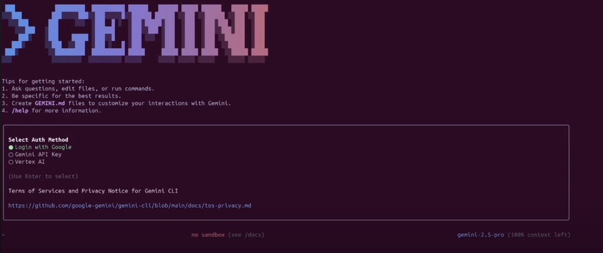
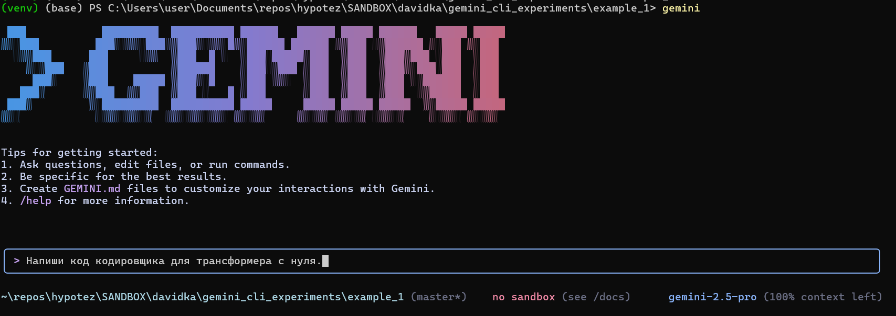
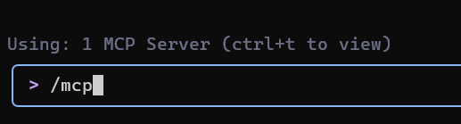

## Gemini CLI : Introduction et premiers pas.

**Gemini CLI** est un outil qui fonctionne directement dans votre terminal, comprend votre base de code et aide à corriger les erreurs à l'aide de requêtes en langage naturel. C'est la réponse de Google à Claude Code d'Anthropic.
Vous pouvez utiliser Gemini 2.5 Pro (l'outil basculera vers Gemini 2.5 Flash si la limite est atteinte) et sa fenêtre contextuelle de 1 million de jetons pour effectuer jusqu'à 60 requêtes par minute et 1000 requêtes par jour, le tout gratuitement.

### Contenu
*   Comprendre et naviguer dans de grandes bases de code
*   Détecter et corriger les bogues
*   Écrire et tester du code
*   Outils Gemini CLI
*   Intégration de Google CLI avec MCP

### Principales fonctionnalités de Gemini CLI :
*   **Édition et refactoring :** Améliore et simplifie automatiquement votre code sous la direction de l'IA.
*   **Détection et correction des bogues :** Trouve les bogues et suggère des corrections.
*   **Compréhension du code :** Gemini CLI peut résumer l'architecture, expliquer les rôles des modules ou construire des cartes de flux d'exécution.
*   **Génération de tests :** Crée automatiquement des cas de test pour `pytest`
*   **Support de documentation :** Vous pouvez créer des documents Markdown structurés, des journaux de modifications (changelogs) et répondre aux problèmes GitHub directement dans le terminal.
*   **Exécution de commandes :** Gemini CLI peut exécuter des commandes shell telles que `git`, `npm`, `pip` et d'autres, vous permettant de gérer des projets sans quitter la CLI.

---


### Étape 1 : Prérequis

Pour commencer, installez Node.js (version 18 ou supérieure). Vous pouvez télécharger l'installateur de votre choix ou exécuter les commandes bash suivantes dans votre terminal :

```bash
# Téléchargement et installation de nvm (Node Version Manager) :
curl -o- https://raw.githubusercontent.com/nvm-sh/nvm/v0.40.3/install.sh | bash

# Initialisation de nvm dans la session de terminal actuelle
. "$HOME/.nvm/nvm.sh"

# Téléchargement et installation de Node.js (par exemple, version 22) :
nvm install 22

# Vérification de la version de Node.js :
node -v # Devrait afficher "v22.17.0" ou similaire

# Vérification de la version de npm :
npm -v # Devrait afficher "10.9.2" ou similaire
```

> ⚠️ **Important pour les utilisateurs de Windows :**
> La commande `nvm` ci-dessus est destinée à **Linux/macOS** et **ne fonctionnera pas dans PowerShell ou cmd.exe**.
> Pour Windows, utilisez [nvm-windows](https://github.com/coreybutler/nvm-windows), en téléchargeant `nvm-setup.exe` depuis la section [Releases](https://github.com/coreybutler/nvm-windows/releases).
> Alternativement, vous pouvez installer WSL (Windows Subsystem for Linux) et exécuter les commandes dans Ubuntu ou une autre distribution Linux.

---
### Étape 2 : Configuration de Gemini CLI

#### Étape 2.1 : Installation de Gemini CLI
Une fois que Node.js et npm sont installés et vérifiés, installez Gemini CLI en exécutant la commande suivante dans votre terminal :
```bash
npx https://github.com/google-gemini/gemini-cli
```
Ou utilisez `npm` pour une installation globale :
```bash
npm install -g @google/gemini-cli
gemini
```
Après l'installation, tapez `gemini` dans votre terminal pour accéder à l'outil.


#### Étape 2.2 : Authentification
Vous pouvez utiliser votre compte Google personnel pour l'authentification. Cela vous donnera jusqu'à 60 requêtes par minute et 1000 requêtes par jour lorsque vous utilisez Gemini.


Dans ce guide, j'ai utilisé **Se connecter avec Google**, mais vous pouvez également utiliser une **clé API** (définie comme variable d'environnement ou dans un fichier `.env`) ou l'authentification **Vertex AI**.

Pour générer une nouvelle clé API, connectez-vous à **AI Studio** avec votre compte Google et cliquez sur "Créer une clé API".
```bash
# Définir la clé comme variable d'environnement
export GEMINI_API_KEY="Your_API_Key"

# Ou créer un fichier .env
GEMINI_API_KEY="Your_API_Key"
```
Vous pouvez utiliser la commande `/auth` dans le champ de texte pour changer les méthodes d'authentification si nécessaire.

---

### Étape 3 : Configuration d'un projet dans Gemini CLI

Une fois la CLI en cours d'exécution, nous pouvons commencer à interagir avec Gemini depuis le terminal. Il existe deux façons de travailler avec un projet.

#### 1. Démarrer un nouveau projet
Pour démarrer un projet à partir de zéro, exécutez les commandes suivantes :
```bash
cd new-project/
gemini
```
Dans la CLI, utilisez une invite pour résoudre le problème qui vous intéresse, par exemple :
> Écrivez le code de l'encodeur pour un transformateur à partir de zéro.

Accorder la permission d'écrire des fichiers :


#### 2. Travailler avec un projet existant
Si vous avez déjà une base de code, vous pouvez travailler avec elle en exécutant les commandes suivantes :
```bash
git clone https://github.com/AashiDutt/Google-Agent-Development-Kit-Demo
cd Google-Agent-Development-Kit-Demo
gemini
```
Dans la CLI, utilisez une invite, par exemple :
> Fournissez-moi un résumé de toutes les modifications apportées à la base de code au cours du dernier mois.

---

### Étape 4 : Expérimenter avec Gemini CLI
À titre d'exemple, j'utiliserai le projet **[Planificateur de voyages basé sur ADK 🌍🛫](https://github.com/AashiDutt/Google-Agent-Development-Kit-Demo)**.
Avec Gemini CLI, je vais montrer comment :
1.  explorer la base de code
2.  détecter un bogue ou un problème sur GitHub ou dans un fichier
3.  refactoriser le code et générer des tests unitaires
4.  créer un rapport Markdown des modifications apportées
5.  visualiser la base de code en générant un organigramme

#### Explorer et comprendre la base de code
Commençons par demander à Gemini d'explorer et d'expliquer la base de code.

**Invite :** `Explorez le répertoire actuel et décrivez l'architecture du projet.`

Gemini CLI renverra un résumé structuré expliquant l'architecture :
*   **Interface utilisateur :** Une application Streamlit (`travel_ui.py`) fournit une interface d'interaction.
*   **Orchestration :** `host_agent` agit comme un coordinateur central.
*   **Agents spécialisés :** `flight_agent`, `stay_agent`, `activities_agent` pour la recherche de vols, d'hôtels et d'activités.
*   **Communication :** Les agents communiquent entre eux via une API RESTful FastAPI.
*   **Composants partagés :** `shared/schemas.py` définit les structures de données communes.

Cela vous aidera à naviguer sans lire chaque fichier manuellement.

#### Analyser et corriger un problème GitHub
Explorons quelques problèmes ouverts du référentiel GitHub.

**Invite :** `Voici un problème GitHub : [@search https://github.com/AashiDutt/Google-Agent-Development-Kit-Demo/issues/1]. Analysez la base de code et proposez un plan de correction en 3 étapes. Quels fichiers/fonctions doivent être modifiés ?`

Gemini CLI a enquêté sur le problème :
*   En utilisant la fonction `@search`, il a récupéré des données de GitHub.
*   A identifié la cause première comme une erreur de sérialisation JSON (dans ce cas, la fonction asynchrone `create_session()` n'a pas été appelée avec `await`).
*   A suggéré des modifications et la gestion des réponses dans plusieurs fichiers.

Ensuite, la CLI attend l'entrée de l'utilisateur pour évaluer les modifications. Si l'utilisateur est d'accord, elle appliquera les modifications suggérées.

#### Implémenter et tester la correction
Maintenant, implémentons et testons les corrections suggérées par Gemini.

**Invite :** `Écrivez un test unitaire pour cette modification dans pytest dans le fichier test_shared.py.`

Gemini CLI :
*   A inséré `json.dumps()` avant d'envoyer la charge utile de la tâche.
*   A créé `test_agents.py` pour ajouter des tests unitaires.
*   A ajouté un nouveau cas de test pour vérifier le schéma et transmettre les messages d'agent imbriqués.

#### Génération de documentation
Maintenant que les corrections ont été appliquées, résumons les modifications et écrivons-les en Markdown dans un fichier `.txt`.

**Invite :** `Écrivez un résumé Markdown du bogue, de la correction et de la couverture des tests. Formatez-le comme une entrée de journal des modifications sous la version "v0.2.0".`

Ensuite, pour enregistrer le résumé dans un document, j'ai utilisé l'invite suivante :

**Invite :** `Enregistrez ce résumé dans un fichier .txt et nommez-le summary.txt`

Gemini CLI utilise l'outil `WriteFile` pour enregistrer le fichier `summary.txt` dans le répertoire du projet.

#### Génération d'un organigramme à l'aide de MCP
Cette section étend les expériences précédentes où j'explore comment Gemini CLI utilise le **Protocole de Contexte de Modèle (MCP)** pour maintenir des résumés au niveau des fichiers et l'historique des tâches entre les invites. Cela donne à Gemini une "mémoire de travail" au sein d'une session.

**Invite :** `Générez un organigramme qui montre comment les agents communiquent via A2A (agent à agent) et comment main.py gère le système. Mettez en évidence où le problème s'est produit et comment il a été résolu.`

Cette visualisation a été rendue possible grâce à la mémoire persistante de Gemini, qui a conservé le contexte complet de notre précédente correction de bogue et de la structure de l'agent sans avoir besoin de recharger les fichiers.

### Outils Gemini CLI disponibles
L'appel de la commande `/tools` dans Gemini CLI affichera une liste des outils disponibles qui peuvent être utilisés pour effectuer diverses tâches, telles que l'édition de code, la génération de tests, la création de documentation, etc.


**ReadFolder (ls)**
Liste les fichiers et dossiers dans un répertoire — similaire à la commande `ls` dans la ligne de commande.

**ReadFile (read-file)**
Lit le contenu complet d'un seul fichier, utile pour créer des résumés ou des analyses.

**ReadManyFiles (read-many-files)**
Lit plusieurs fichiers à la fois, généralement par motif (par exemple, tous les fichiers `.js`).

**FindFiles (glob)**
Recherche des fichiers par motif (par exemple, trouver tous les fichiers `config.json` dans votre projet).

**SearchText (grep)**
Recherche du texte dans les fichiers, par exemple, pour trouver tous les commentaires `TODO`.

**Edit (edit)**
Applique les modifications de code à l'aide de `diff`. Gemini affiche un aperçu des modifications et demande une confirmation avant de les appliquer.

**WriteFile (write-file)**
Crée de nouveaux fichiers (par exemple, `README.md`) avec le contenu fourni par l'utilisateur.

**Shell (shell)**
Exécute des commandes directement dans le terminal si vous les préfixez avec `!` (par exemple, `!npm test`).

**WebFetch (web-fetch)**
Télécharge du contenu du web (HTML ou JSON), permettant à Gemini d'analyser des données externes.

**GoogleSearch (web-search)**
Effectue une recherche Google pour baser les réponses sur des informations du monde réel (par exemple, pour trouver une explication à une erreur).

**Save Memory (memoryTool)**
Enregistre des faits ou des préférences pendant une session (par exemple, "Je préfère async/await") pour améliorer la cohérence des réponses.


### Fonctionnalités avancées

Vous pouvez ajouter des instructions spéciales pour l'IA pour un projet spécifique en
créant un fichier `GEMINI.md` dans le répertoire racine de votre projet.
Dans ce fichier, vous pouvez définir les règles du projet,
les styles de code et les outils que l'agent doit utiliser. Cela garantit que le code généré est conforme aux normes de votre projet.

[Exemple d'instruction système](https://github.com/hypo69/hypotez/blob/master/src/endpoints/hypo69/code_assistant/instructions/CODE_RULES.EN.MD)

### Intégration de Google CLI avec MCP

Pour la plupart des tâches quotidiennes, les outils intégrés suffiront. Mais que se passe-t-il si vous souhaitez que Gemini CLI fasse quelque chose de très spécialisé, comme interagir avec des API spécifiques ou utiliser un modèle spécialisé (par exemple, un générateur d'images ou un outil d'analyse de sécurité) ? C'est là qu'intervient le MCP (Model Context Protocol).

Essentiellement, le MCP est une norme ouverte qui permet aux développeurs d'ajouter de nouveaux outils et capacités à l'IA en exécutant un serveur avec lequel la CLI peut interagir. Dans Gemini CLI, vous pouvez configurer des "serveurs MCP" dans un fichier de paramètres JSON, et la CLI les traitera comme des outils supplémentaires qu'elle peut utiliser.

#### Comment configurer un serveur MCP dans Google CLI

À titre d'exemple, je vais vous montrer comment configurer un serveur MCP pour GitHub dans Gemini CLI.

Dans le dossier de votre projet, créez un dossier à l'aide de la commande :

```bash
mkdir -p .gemini && touch .gemini/settings.json
```
Remplissez le fichier avec ce code :
```json
{
  "mcpServers": {
    "github": {
      "command": "npx",
      "args": ["-y", "@modelcontextprotocol/server-github"],
      "env": { "GITHUB_PERSONAL_ACCESS_TOKEN": "[YOUR-TOKEN]" }
    }
  }
}
```
[instructions sur la façon d'obtenir un jeton](https://docs.github.com/en/authentication/keeping-your-account-and-data-secure/managing-your-personal-access-tokens#creating-a-personal-access-token-classic)
Après cela, tapez `/quit` dans Gemini CLI pour quitter, puis rouvrez-le.
Vous verrez que le serveur MCP de GitHub est en cours d'exécution et prêt à l'emploi.

Tapez la commande `/mcp`, et vous verrez une liste des outils GitHub.
