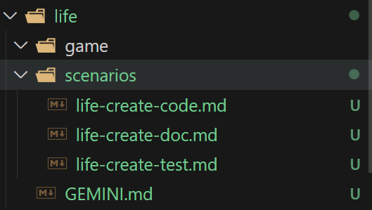
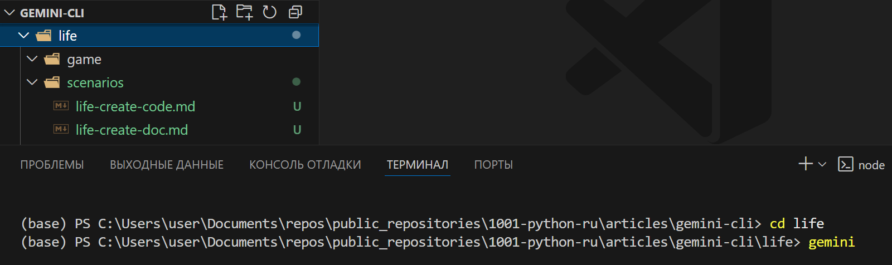
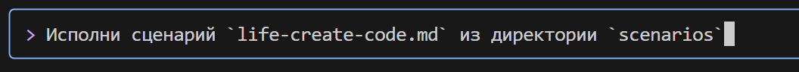
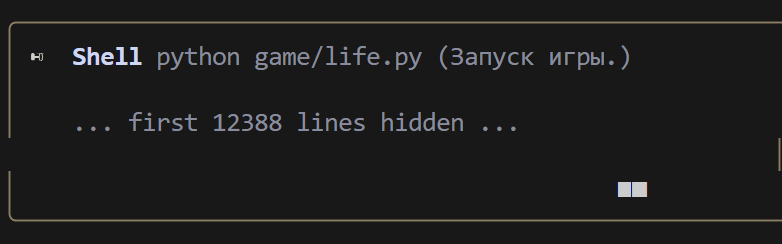
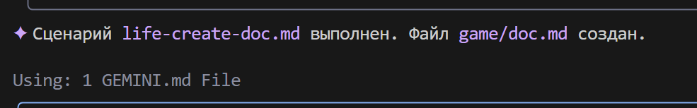

### **Scénario pour Gemini CLI : Jeu de la Vie**

#### **Étape 1 : Création d'une instruction système `GEMINI.MD`**
Dans le répertoire de travail, créez un fichier `GEMINI.md` et insérez-y l'instruction système. Exemple d'instruction :
```markdown
## 📘 Instruction pour la génération de code Python

### 1. Règles générales

* Utilisez **Python 3.10+**.
* Adhérez à un **style de codage clair, lisible et non ambigu**.
* **Chaque fonction, méthode et classe** doit avoir :

  * Des annotations de type (`type hints`)
  * Une documentation complète et correcte au format `docstring` (voir section 3)
  * Des commentaires internes (`#`), si nécessaire

---

### 2. Commentaires

* Les commentaires doivent être **précis** et décrire **ce que le code fait**, et non "ce que nous faisons".
* **Interdit** d'utiliser des pronoms : `nous faisons`, `nous retournons`, `nous envoyons`, `nous allons`, etc.
* **Autorisé** uniquement les termes : `extraction`, `exécution`, `appel`, `remplacement`, `vérification`, `envoi`, `La fonction exécute`, `La fonction modifie la valeur`, etc.

#### ❌ Exemple de commentaire incorrect :

```python
# Obtenir la valeur du paramètre
```

#### ✅ Exemple de commentaire correct :

```python
# La fonction extrait la valeur du paramètre
```

---

### 3. Docstring (format de documentation)

Chaque fonction/méthode/classe doit contenir un `docstring` au format suivant :

```python
def function(param: str, param1: Optional[str | dict | str] = None) -> dict | None:
    """
    Args:
        param (str): Description du paramètre `param`.
        param1 (Optional[str | dict | str], optional): Description du paramètre `param1`. Par défaut `None`.

    Returns:
        dict | None: Description de la valeur de retour. Renvoie un dictionnaire ou `None`.

    Raises:
        SomeError: Description de la situation dans laquelle l'exception `SomeError` se produit.

    Example:
        >>> function('param', 'param1')
        {'param': 'param1'}
    """
```

* **Tous les paramètres et valeurs de retour doivent être décrits.**
* Les formulations doivent être **concises, précises et non ambiguës**.
* Il n'est pas permis d'omettre la description des paramètres/valeurs de retour/exceptions.

---

### 4. Annotation de type

* **Toutes les variables, paramètres et valeurs de retour** doivent être annotés.
* Utilisez la syntaxe Python 3.10+ : `list[int]`, `dict[str, Any]`, `str | None`, etc.
* Exemples d'annotations correctes :

#### ✅ Types simples :

```python
name: str = "John"
count: int = 42
flag: bool = True
```

#### ✅ Collections et types complexes :

```python
from typing import Any, Optional, Callable, TypeAlias

coordinates: tuple[float, float] = (55.75, 37.61)
metadata: dict[str, Any] = {"debug": True}
UserId: TypeAlias = int
```

#### ✅ Fonctions et méthodes :

```python
def get_user_name(user_id: int) -> str:
    """Renvoie le nom de l'utilisateur par son identifiant."""
    ...
```

#### ✅ Fonctions asynchrones :

```python
async def fetch_users() -> AsyncIterator[dict[str, int | str]]:
    ...
```

#### ✅ Types génériques :

```python
from typing import TypeVar, Generic

T = TypeVar("T")

class Container(Generic[T]):
    def __init__(self, value: T) -> None:
        self.value = value

    def get(self) -> T:
        return self.value
```

---

### 5. Autre

* Utilisez `default_factory` dans `dataclass` pour les valeurs mutables (`list`, `dict`).
* Pour les valeurs `Optional`, spécifiez `T | None` (Python 3.10+) ou `Optional[T]`.
* Pour les structures complexes, utilisez `TypeAlias`.

---

📌 **Astuce** : Lors de la génération de code, incluez toujours des annotations de type, des `docstring`, et évitez les formulations subjectives dans les commentaires. L'objectif est une structure de code aussi précise, reproductible et formalisée que possible.


Ce fichier sera utilisé pour configurer Gemini CLI.

Pour plus de commodité, créons un répertoire `game`, qui stockera les fichiers du projet, et un répertoire `scenarios`, qui stockera les scénarios pour Gemini CLI.

Le fichier `scenarios/life-create-code.md` contiendra les instructions pour créer le code du "Jeu de la Vie",
le fichier `scenarios/life-create-test.md` contiendra les instructions pour créer des tests,
le fichier `scenarios/life-create-doc.md` contiendra les instructions pour créer de la documentation.

life-create-code.md:
```markdown
Dans le répertoire `game`, créez un fichier `life.py`.
À l'intérieur, écrivez l'implémentation du "Jeu de la Vie" de Conway en Python, en utilisant une approche orientée objet.
Utilisez les bibliothèques : `numpy`, `pygame` (pour les graphiques).


Exigences :
1.  Créez une classe `Game`.
2.  Dans `__init__`, la classe doit accepter les dimensions de la grille (largeur, hauteur) et créer un champ initial aléatoire.
3.  Créez une méthode `step()` qui met à jour l'état du jeu d'un pas selon les règles :
    - Une cellule vivante avec < 2 voisins vivants meurt (solitude).
    - Une cellule vivante avec 2 ou 3 voisins vivants survit.
    - Une cellule vivante avec > 3 voisins vivants meurt (surpopulation).
    - Une cellule morte avec exactement 3 voisins vivants devient vivante (naissance).
4.  Créez une méthode `display()` ou remplacez `__str__` pour afficher le champ dans la console. Utilisez des caractères, par exemple '■' pour une cellule vivante et ' ' pour une cellule morte.
5.  Utilisez la bibliothèque `numpy` pour des opérations efficaces sur la grille.
6.  Dans le bloc `if __name__ == '__main__':` ajoutez un exemple qui crée un jeu et exécute la simulation en boucle avec un petit délai entre les étapes.
7. Pour la visualisation du jeu, utilisez pygame ou une autre bibliothèque graphique, si possible.
```

---

life-create-test.md:
```markdown
Dans le répertoire `game`, en utilisant le contexte du fichier @life.py, créez un fichier avec des tests `test_life.py`. Utilisez le framework pytest.

Le test doit vérifier l'évolution correcte d'un simple oscillateur "Blinker" (trois cellules d'affilée).

Scénario de test :
1.  Importez la classe `Game` de `life`.
2.  Créez une fonction de test, par exemple `test_blinker_oscillation`.
3.  Dans le test, créez une instance `Game` avec une taille fixe (par exemple, 5x5).
4.  Définissez manuellement l'état initial du champ de manière à ce qu'il y ait une ligne horizontale de trois cellules vivantes (Blinker) au centre.
5.  Appelez la méthode `game.step()`.
6.  À l'aide de `assert` et `numpy.array_equal`, vérifiez que le champ a changé en une ligne verticale de trois cellules.
7.  Appelez la méthode `game.step()` à nouveau.
8.  Vérifiez que le champ est revenu à son état horizontal d'origine.
```

---

life-create-doc.md:
```markdown
Analysez les fichiers @life.py et @test_life.py dans le répertoire `game` et créez un fichier de documentation `doc.md` basé sur ceux-ci.

La structure de la documentation doit être la suivante :
-   **Titre :** # Projet "Jeu de la Vie"
-   **Brève description :** Explication de ce qu'est ce projet (implémentation de l'automate cellulaire de Conway).
-   **Structure des fichiers :** Brève description de l'objectif des fichiers `life.py` et `test_life.py`.
-   **Comment exécuter la simulation :** Section avec la commande pour exécuter le fichier principal (`python life.py`).
-   **Comment exécuter les tests :** Section avec la commande pour exécuter les tests (`pip install pytest numpy`, puis `pytest`).
```

La structure des répertoires ressemblera à ceci :



#### **Étape 2 : Création du code du "Jeu de la Vie"**

Lancez gemini-cli dans le terminal :


Important ! Assurez-vous d'être dans le répertoire où se trouve le fichier `GEMINI.md`.




Donnez la permission de créer le fichier :


Après cela, gemini-cli générera le fichier `life.py` dans le répertoire `game` :


Continuer :
```bash
Créez un environnement virtuel venv, installez les dépendances nécessaires et exécutez le code du jeu.
```


Donnez les autorisations nécessaires pour exécuter les scripts


pip


et enfin gemini-cli démarre le jeu :


Étape 3 : Création des tests


Erreur


gemini-cli essaie de résoudre le problème


Dernière étape — création de la documentation


Voilà ! Documentation créée :
