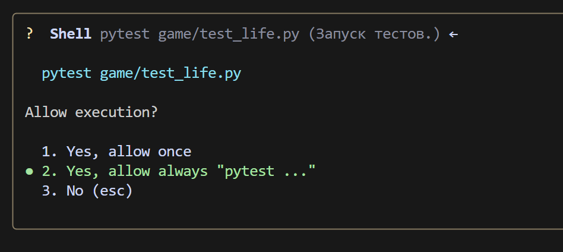

### **תרחיש עבור Gemini CLI: משחק החיים**

#### **שלב 1: יצירת הוראת מערכת `GEMINI.MD`**
בתיקיית העבודה, צור קובץ `GEMINI.md` והכנס לתוכו את הוראת המערכת. דוגמה להוראה:
```markdown
## 📘 הוראה ליצירת קוד פייתון

### 1. כללים כלליים

* השתמש ב-**Python 3.10+**.
* הקפד על **סגנון קידוד ברור, קריא וחד משמעי**.
* **כל פונקציה, מתודה ומחלקה** חייבת לכלול:

  * הערות טיפוסים (`type hints`)
  * תיעוד מלא ונכון בפורמט `docstring` (ראה סעיף 3)
  * הערות פנימיות (`#`), היכן שצריך

---

### 2. הערות

* הערות חייבות להיות **מדויקות** ולתאר **מה הקוד עושה**, ולא "מה אנחנו עושים".
* **אסור** להשתמש בכינויי גוף: `אנחנו עושים`, `אנחנו מחזירים`, `אנחנו שולחים`, `אנחנו הולכים`, וכו'.
* **מותר** רק במונחים: `חילוץ`, `ביצוע`, `קריאה`, `החלפה`, `בדיקה`, `שליחה`, `הפונקציה מבצעת`, `הפונקציה משנה ערך`, וכו'.

#### ❌ דוגמה להערה שגויה:

```python
# קבל את ערך הפרמטר
```

#### ✅ דוגמה להערה נכונה:

```python
# הפונקציה מחלצת את ערך הפרמטר
```

---

### 3. Docstring (פורמט תיעוד)

כל פונקציה/מתודה/מחלקה חייבת לכלול `docstring` בפורמט הבא:

```python
def function(param: str, param1: Optional[str | dict | str] = None) -> dict | None:
    """
    Args:
        param (str): תיאור הפרמטר `param`.
        param1 (Optional[str | dict | str], optional): תיאור הפרמטר `param1`. ברירת מחדל `None`.

    Returns:
        dict | None: תיאור ערך ההחזרה. מחזיר מילון או `None`.

    Raises:
        SomeError: תיאור המצב שבו מתרחשת חריגת `SomeError`.

    Example:
        >>> function('param', 'param1')
        {'param': 'param1'}
    """
```

* **כל הפרמטרים וערכי ההחזרה חייבים להיות מתוארים.**
* הניסוחים חייבים להיות **תמציתיים, מדויקים וחד משמעיים**.
* אין להשמיט תיאור של פרמטרים/ערכי החזרה/חריגות.

---

### 4. הערת טיפוסים

* **כל המשתנים, הפרמטרים וערכי ההחזרה** חייבים להיות מוערים.
* השתמש בתחביר פייתון 3.10+: `list[int]`, `dict[str, Any]`, `str | None`, וכו'.
* דוגמאות להערות נכונות:

#### ✅ טיפוסים פשוטים:

```python
name: str = "John"
count: int = 42
flag: bool = True
```

#### ✅ אוספים וטיפוסים מורכבים:

```python
from typing import Any, Optional, Callable, TypeAlias

coordinates: tuple[float, float] = (55.75, 37.61)
metadata: dict[str, Any] = {"debug": True}
UserId: TypeAlias = int
```

#### ✅ פונקציות ומתודות:

```python
def get_user_name(user_id: int) -> str:
    """מחזירה את שם המשתמש לפי המזהה שלו."""
    ...
```

#### ✅ פונקציות אסינכרוניות:

```python
async def fetch_users() -> AsyncIterator[dict[str, int | str]]:
    ...
```

#### ✅ טיפוסים גנריים:

```python
from typing import TypeVar, Generic

T = TypeVar("T")

class Container(Generic[T]):
    def __init__(self, value: T) -> None:
        self.value = value

    def get(self) -> T:
        return self.value
```

---

### 5. אחר

* השתמש ב-`default_factory` ב-`dataclass` עבור ערכים ניתנים לשינוי (`list`, `dict`).
* עבור ערכי `Optional`, ציין `T | None` (פייתון 3.10+) או `Optional[T]`.
* עבור מבנים מורכבים - השתמש ב-`TypeAlias`.

---

📌 **רמז**: בעת יצירת קוד, כלול תמיד הערות טיפוסים, `docstring`, והימנע מניסוחים סובייקטיביים בהערות. המטרה היא מבנה קוד מדויק, ניתן לשחזור ומפורמל ככל האפשר.


קובץ זה ישמש להגדרת Gemini CLI.

לנוחות, ניצור תיקיית `game`, שתאחסן את קבצי הפרויקט, ותיקיית `scenarios`, שתאחסן תרחישים עבור Gemini CLI.

הקובץ `scenarios/life-create-code.md` יכיל הוראות ליצירת קוד "משחק החיים",
הקובץ `scenarios/life-create-test.md` יכיל הוראות ליצירת בדיקות,
והקובץ `scenarios/life-create-doc.md` יכיל הוראות ליצירת תיעוד.

life-create-code.md:
```markdown
בתוך תיקיית `game`, צור קובץ `life.py`.
בתוכו, כתוב את מימוש "משחק החיים" של קונווי בפייתון, תוך שימוש בגישה מונחית עצמים.
השתמש בספריות: `numpy`, `pygame` (לגרפיקה).


דרישות:
1.  צור מחלקה `Game`.
2.  ב-`__init__`, המחלקה צריכה לקבל מימדי רשת (רוחב, גובה) וליצור שדה התחלתי אקראי.
3.  צור מתודה `step()` המעדכנת את מצב המשחק בצעד אחד לפי הכללים:
    - תא חי עם < 2 שכנים חיים מת (בדידות).
    - תא חי עם 2 או 3 שכנים חיים שורד.
    - תא חי עם > 3 שכנים חיים מת (צפיפות יתר).
    - תא מת עם בדיוק 3 שכנים חיים הופך לחי (לידה).
4.  צור מתודה `display()` או עקוף את `__str__` כדי להדפיס את השדה לקונסולה. השתמש בתווים, למשל '■' לתא חי ו-' ' לתא מת.
5.  השתמש בספריית `numpy` לפעולות רשת יעילות.
6.  בבלוק `if __name__ == '__main__':` הוסף דוגמה שיוצרת משחק ומריצה את הסימולציה בלולאה עם השהיה קטנה בין צעדים.
7. להדמיית המשחק, השתמש ב-pygame או בספריית גרפיקה אחרת, אם אפשר.
```

---

life-create-test.md:
```markdown
בתוך תיקיית `game`, תוך שימוש בהקשר מהקובץ @life.py, צור קובץ עם בדיקות `test_life.py`. השתמש בפריימוורק pytest.

הבדיקה צריכה לבדוק את האבולוציה הנכונה של מתנד "מהבהב" פשוט (שלושה תאים בשורה).

תרחיש בדיקה:
1.  ייבא את המחלקה `Game` מ-`life`.
2.  צור פונקציית בדיקה, לדוגמה `test_blinker_oscillation`.
3.  בתוך הבדיקה, צור מופע `Game` בגודל קבוע (לדוגמה, 5x5).
4.  הגדר ידנית את המצב ההתחלתי של השדה כך שבמרכז תהיה שורה אופקית של שלושה תאים חיים (מהבהב).
5.  קרא למתודה `game.step()`.
6.  באמצעות `assert` ו-`numpy.array_equal`, בדוק שהשדה השתנה לשורה אנכית של שלושה תאים.
7.  קרא למתודה `game.step()` שוב.
8.  בדוק שהשדה חזר למצבו האופקי המקורי.
```

---

life-create-doc.md:
```markdown
נתח את הקבצים @life.py ו-@test_life.py בתוך תיקיית `game` וצור קובץ תיעוד `doc.md` על בסיסם.

מבנה התיעוד צריך להיות כדלקמן:
-   **כותרת:** # פרויקט "משחק החיים"
-   **תיאור קצר:** הסבר מהו הפרויקט הזה (מימוש אוטומט תאי של קונווי).
-   **מבנה קבצים:** תיאור קצר של מטרת הקבצים `life.py` ו-`test_life.py`.
-   **כיצד להריץ את הסימולציה:** סעיף עם הפקודה להפעלת הקובץ הראשי (`python life.py`).
-   **כיצד להריץ בדיקות:** סעיף עם הפקודה להפעלת בדיקות (`pip install pytest numpy`, ולאחר מכן `pytest`).
```

מבנה התיקיות ייראה כך:


#### **שלב 2: יצירת קוד "משחק החיים"**

הפעל את gemini-cli בטרמינל:


חשוב! ודא שאתה נמצא בתיקייה שבה נמצא קובץ `GEMINI.md`.


תן הרשאה ליצירת הקובץ:


לאחר מכן, gemini-cli ייצור את הקובץ `life.py` בתיקיית `game`:


המשך:
```bash
צור סביבה וירטואלית venv, התקן את התלויות הנדרשות והפעל את קוד המשחק.
```


תן את ההרשאות הנדרשות להפעלת סקריפטים


pip


ולבסוף gemini-cli מפעיל את המשחק:


שלב 3: יצירת בדיקות




שגיאה


gemini-cli מנסה לפתור את הבעיה


שלב אחרון - יצירת תיעוד


וואלה! התיעוד נוצר:
