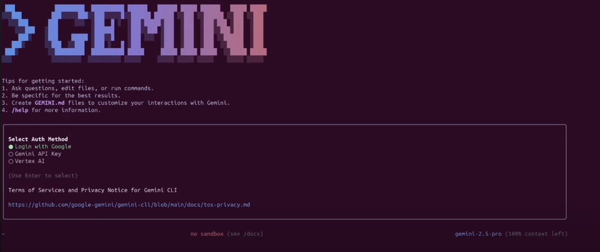
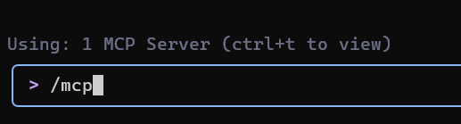
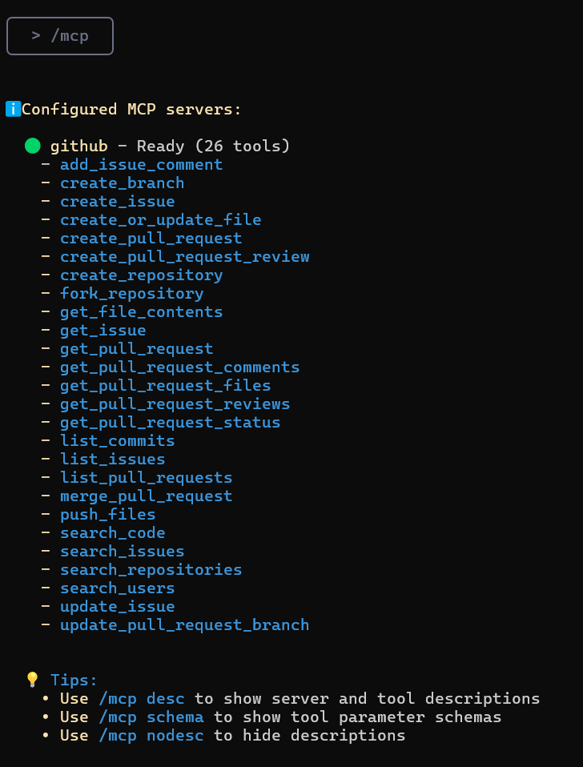

## Gemini CLI: Знакомство и первые шаги.

**Gemini CLI** — это инструмент, который работает прямо в вашем терминале, понимает вашу кодовую базу и помогает исправлять ошибки с помощью запросов на естественном языке. Это ответ Google на Claude Code от Anthropic.
Вы можете использовать Gemini 2.5 Pro (при достижении лимита инструмент переключится на Gemini 2.5 Flash) и его контекстное окно в 1 миллион токенов для выполнения до 60 запросов в минуту и 1000 запросов в день, и все это бесплатно.

### Содержание
*   Понимание и навигация по большим кодовым базам
*   Обнаружение и исправление ошибок
*   Написание и тестирование кода
*   Инструменты Gemini CLI
*   Интеграция Google CLI с MCP

### Ключевые возможности Gemini CLI:
*   **Редактирование и рефакторинг:** Автоматически улучшает и упрощает ваш код под руководством ИИ.
*   **Обнаружение и исправление ошибок:** Находит баги и предлагает исправления.
*   **Понимание кода:** Gemini CLI может обобщать архитектуру, объяснять роли модулей или строить карты потоков выполнения.
*   **Генерация тестов:** Автоматически создает тестовые задания для `pytest`
*   **Поддержка документации:** Вы можете создавать структурированные markdown-документы, списки изменений (changelogs) и ответы на GitHub issues прямо в терминале.
*   **Исполнение команд:** Gemini CLI может выполнять команды оболочки, такие как `git`, `npm`, `pip` и другие, что позволяет вам управлять проектами без выхода из CLI.

---


### Шаг 1: Предварительные требования

Для начала установите Node.js (версия 18 или выше). Вы можете скачать установщик по вашему выбору или выполнить следующие bash-команды в вашем терминале:

```bash
# Скачивание и установка nvm (Node Version Manager):
curl -o- https://raw.githubusercontent.com/nvm-sh/nvm/v0.40.3/install.sh | bash

# Инициализация nvm в текущей сессии терминала
. "$HOME/.nvm/nvm.sh"

# Скачивание и установка Node.js (например, версии 22):
nvm install 22

# Проверка версии Node.js:
node -v # Должно вывести "v22.17.0" или похожее

# Проверка версии npm:
npm -v # Должно вывести "10.9.2" или похожее
```

> ⚠️ **Важно для пользователей Windows:**
> Указанная выше команда `nvm` предназначена для **Linux/macOS** и **не будет работать в PowerShell или cmd.exe**.
> Для Windows используйте [nvm-windows](https://github.com/coreybutler/nvm-windows), скачав `nvm-setup.exe` из раздела [Releases](https://github.com/coreybutler/nvm-windows/releases).
> Альтернативно вы можете установить WSL (Windows Subsystem for Linux) и выполнить команды в Ubuntu или другой Linux-дистрибутиве.

---
### Шаг 2: Настройка Gemini CLI

#### Шаг 2.1: Установка Gemini CLI
Когда Node.js и npm установлены и проверены, установите Gemini CLI, выполнив следующую команду в вашем терминале:
```bash
npx https://github.com/google-gemini/gemini-cli
```
Или используйте `npm` для глобальной установки:
```bash
npm install -g @google/gemini-cli
gemini
```
После установки введите `gemini` в терминале, чтобы получить доступ к инструменту.


#### Шаг 2.2: Аутентификация
Вы можете использовать ваш личный аккаунт Google для аутентификации. Это предоставит вам до 60 запросов в минуту и 1000 запросов в день при использовании Gemini.


В этом руководстве я использовал **Вход через Google**, но вы также можете использовать **API-ключ** (установленный как переменная окружения или в файле `.env`) или аутентификацию через **Vertex AI**.

Чтобы сгенерировать новый API-ключ, войдите в **AI Studio** с вашим аккаунтом Google и нажмите "Создать API-ключ".
```bash
# Установка ключа как переменной окружения
export GEMINI_API_KEY="Your_API_Key"

# Или создайте файл .env
GEMINI_API_KEY="Your_API_Key"
```
Вы можете использовать команду `/auth` в текстовом поле для переключения метода аутентификации по мере необходимости.

---

### Шаг 3: Настройка проекта в Gemini CLI

Когда CLI запущен, мы можем начать взаимодействовать с Gemini из терминала. Есть два способа работы с проектом.

#### 1. Начать новый проект
Чтобы начать проект с нуля, выполните следующие команды:
```bash
cd new-project/
gemini
```
Внутри CLI используйте промпт для решения интересующей вас проблемы, например:
> Напиши код кодировщика для трансформера с нуля.

Дайте разрешение на запись файлов:


#### 2. Работать с существующим проектом
Если у вас уже есть кодовая база, вы можете работать с ней, выполнив следующие команды:
```bash
git clone https://github.com/AashiDutt/Google-Agent-Development-Kit-Demo
cd Google-Agent-Development-Kit-Demo
gemini
```
Внутри CLI используйте промпт, например:
> Предоставь мне сводку всех изменений, внесенных в кодовую базу за последний месяц.

---

### Шаг 4: Эксперименты с Gemini CLI
В качестве примера я буду использовать проект **[Планировщик 🌍🛫 путешествий на базе ADK](https://github.com/AashiDutt/Google-Agent-Development-Kit-Demo)**. 
С помощью Gemini CLI я покажу как:
1.  исследовать кодовую базу
2.  обнаружить ошибку или проблему на GitHub или в файле
3.  провести рефакторинг кода и сгенерировать юнит-тесты
4.  создать markdown-отчет о внесенных изменениях
5.  визуализировать кодовую базу, сгенерировав блок-схему

#### Исследование и понимание кодовой базы
Начнем с того, что попросим Gemini исследовать и объяснить кодовую базу.

**Промпт:** `Исследуй текущий каталог и опиши архитектуру проекта.`

Gemini CLI вернет структурированное резюме, объясняющее архитектуру:
*   **Пользовательский интерфейс:** Приложение на Streamlit (`travel_ui.py`) предоставляет интерфейс для взаимодействия.
*   **Оркестрация:** `host_agent` действует как центральный координатор.
*   **Специализированные агенты:** `flight_agent`, `stay_agent`, `activities_agent` для поиска авиабилетов, отелей и развлечений.
*   **Коммуникация:** Агенты общаются друг с другом через RESTful API на FastAPI.
*   **Общие компоненты:** `shared/schemas.py` определяет общие структуры данных.

Это поможет сориентироваться, не читая каждый файл вручную.

#### Анализ и исправление проблемы на GitHub
Исследуем некоторые открытые проблемы из репозитория GitHub.

**Промпт:** `Вот проблема на GitHub: [@search https://github.com/AashiDutt/Google-Agent-Development-Kit-Demo/issues/1]. Проанализируй кодовую базу и предложи 3-шаговый план исправления. Какие файлы/функции следует изменить?`

Gemini CLI исследовал проблему:
*   Используя функцию `@search`, он получил данные с GitHub.
*   Определил основную причину как ошибку сериализации JSON (в данном случае, асинхронная функция `create_session()` не была вызвана с `await`).
*   Предложил изменения и обработку ответа в нескольких файлах.

Далее CLI ожидает ввода от пользователя для оценки изменений. Если пользователь согласен, он внесет предложенные изменения.

#### Внедрение и тестирование исправления
Теперь внедрим и протестируем предложенные Gemini исправления.

**Промпт:** `Напиши юнит-тест для этого изменения в pytest в файле test_shared.py.`

Gemini CLI:
*   Вставил `json.dumps()` перед отправкой полезной нагрузки задачи.
*   Создал `test_agents.py` для добавления юнит-тестов.
*   Добавил новый тестовый случай для проверки схемы и передачи вложенных сообщений агентов.

#### Генерация документации
Теперь, когда исправления внесены, подведем итоги изменений и запишем их в Markdown в файле `.txt`.

**Промпт:** `Напиши markdown-сводку об ошибке, исправлении и тестовом покрытии. Отформатируй это как запись в журнале изменений под версией "v0.2.0".`

Затем, чтобы сохранить сводку в документ, я использовал следующий промпт:

**Промпт:** `Сохрани эту сводку в файл .txt и назови его summary.txt`

Gemini CLI использует инструмент `WriteFile` для сохранения файла `summary.txt` в каталоге проекта.

#### Генерация блок-схемы с использованием MCP
Этот раздел расширяет предыдущие эксперименты, где я исследую, как Gemini CLI использует **Model Context Protocol (MCP)** для поддержания сводок на уровне файлов и истории задач между промптами. Это дает Gemini "рабочую память" в рамках сессии.

**Промпт:** `Сгенерируй блок-схему, которая показывает, как агенты общаются через A2A (agent-to-agent) и как main.py управляет системой. Выдели, где произошла проблема и как она была исправлена.`

Эта визуализация стала возможной благодаря постоянной памяти Gemini, которая сохранила полный контекст нашего предыдущего исправления ошибки и структуры агента без необходимости повторной загрузки файлов.

### Доступные инструменты Gemini CLI
Вызов команды `/tools` в Gemini CLI, покажет список доступных инструментов, которые можно использовать для выполнения различных задач, таких как редактирование кода, генерация тестов, создание документации и многое другое.


**ReadFolder (ls)**
Перечисляет файлы и папки в директории — аналог команды `ls` в командной строке.

**ReadFile (read-file)**
Читает полное содержимое одного файла, что полезно для создания сводок или анализа.

**ReadManyFiles (read-many-files)**
Читает несколько файлов одновременно, обычно по шаблону (например, все файлы `.js`).

**FindFiles (glob)**
Ищет файлы по шаблону (например, найти все файлы `config.json` в вашем проекте).

**SearchText (grep)**
Ищет текст внутри файлов, например, для нахождения всех комментариев `TODO`.

**Edit (edit)**
Применяет изменения в коде с помощью `diff`. Gemini показывает предварительный просмотр правок и запрашивает подтверждение перед их применением.

**WriteFile (write-file)**
Создает новые файлы (например, `README.md`) с содержимым, предоставленным пользователем.

**Shell (shell)**
Выполняет команды непосредственно в терминале, если вы добавляете перед ними префикс `!` (например, `!npm test`).

**WebFetch (web-fetch)**
Загружает контент из веба (HTML или JSON), позволяя Gemini анализировать внешние данные.

**GoogleSearch (web-search)**
Выполняет поиск в Google, чтобы основывать ответы на реальной информации (например, для поиска объяснения ошибки).

**Save Memory (memoryTool)**
Сохраняет факты или предпочтения во время сессии (например, «я предпочитаю async/await»), чтобы улучшить последовательность и согласованность ответов.


### Расширенные возможности

Вы можете добавлять специальные инструкции для ИИ для конкретного проекта, 
создав файл `GEMINI.md` в корневом каталоге вашего проекта. 
Внутри этого файла вы можете определять правила проекта, 
стили кода и инструменты, которые должен использовать агент. Это гарантирует, что сгенерированный код соответствует стандартам вашего проекта.

[Пример системной инструкции](https://github.com/hypo69/hypotez/blob/master/src/endpoints/hypo69/code_assistant/instructions/CODE_RULES.EN.MD)

### Интеграция Google CLI с MCP

Для большинства повседневных задач будет достаточно встроенных инструментов. Но что, если вы хотите, чтобы Gemini CLI делал что-то узкоспециализированное, например, взаимодействовал с определенными API или использовал специализированную модель (скажем, генератор изображений или инструмент для анализа безопасности)? Именно здесь на помощь приходит MCP (протокол модельного контекста).

По сути, MCP — это открытый стандарт, который позволяет разработчикам добавлять в ИИ новые инструменты и возможности путем запуска сервера, с которым может взаимодействовать CLI. В Gemini CLI вы можете настроить «MCP-серверы» в файле настроек JSON, и CLI будет рассматривать их как дополнительные инструменты, которые он может использовать.

#### Как настроить MCP-сервер в Google CLI

В качестве примера я покажу вам, как настроить MCP-сервер для GitHub в Gemini CLI.

Внутри папки вашего проекта создайте папку с помощью команды:

```bash
mkdir -p .gemini && touch .gemini/settings.json
```
Заполните файл этим кодом:
```json
{  
  "mcpServers": {  
    "github": {  
      "command": "npx",  
      "args": ["-y", "@modelcontextprotocol/server-github"],  
      "env": { "GITHUB_PERSONAL_ACCESS_TOKEN": "[YOUR-TOKEN]" }  
    }  
  }  
}
```
[инструкция как получить токен](https://docs.github.com/en/authentication/keeping-your-account-and-data-secure/managing-your-personal-access-tokens#creating-a-personal-access-token-classic)
После этого введите `/quit` в Gemini CLI, чтобы выйти, а затем снова откройте его.
Вы увидите, что MCP-сервер GitHub запущен и готов к использованию.

Введите команду `/mcp`, и вы увидите список инструментов GitHub.
